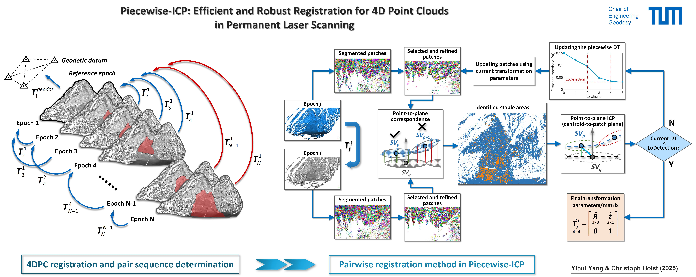

<h1 align="center">Piecewise-ICP: Efficient and Robust Registration for 4D Point Clouds in Permanent Laser Scanning</h1>

<p align="center">
  <a href="https://www.asg.ed.tum.de/gds/team/yihui-yang/"><strong>Yihui Yang</strong></a> ·
  <a href="https://www.asg.ed.tum.de/gds/holst/"><strong>Christoph Holst</strong></a><br>
  <a href="https://www.asg.ed.tum.de/gds/home/"><strong>Chair of Engineering Geodesy, TUM</strong></a>
</p>

<p align="center">
  
</p>

<br>  

This repository provides the implementation code and partial test data for the paper: [**Piecewise-ICP: Efficient and Robust Registration for 4D Point Clouds in Permanent Laser Scanning**](https://www.sciencedirect.com), published in the ISPRS Journal of Photogrammetry and Remote Sensing.

*__Piecewise-ICP__ can accurately register point cloud time series (__4D point clouds__) in a __robust__ and __efficient__ way, even when the point cloud undergoes large-scale deformation or changes.
It is a __target-free__ and __learning-free__ point cloud registration algorithm that does not rely on keypoint detection and matching, nor does it require color or intensity information. It operates directly on geometric structures and is particularly well-suited for __fine registration__ tasks in laser scanning-based deformation monitoring.*


## 📚 Table of Contents

- [Abstract](#abstract)
- [Installation](#installation)
- [Quick Use](#quick-use)
- [Datasets](#datasets)
- [Acknowledgements](#acknowledgements)
- [Citation](#citation)
- [License](#license)

****
<a name="abstract"></a>
## 📝 Abstract
The permanent terrestrial laser scanning (PLS) system has significantly improved the temporal and spatial resolution of surface capture in geomonitoring tasks. Accurate registration of the four-dimensional (3D space + time) point clouds (4DPC) generated by PLS is the prerequisite for subsequent deformation analysis. However, due to the massive data volume and potential changes between scans, achieving automatic, efficient, and robust registration of 4DPC remains challenging, especially in scenarios lacking signalized and reliable targets. To address the challenges in target-free registration of 4DPC from PLS, we propose Piecewise-ICP, a robust and efficient fine registration method. Assuming the stable areas on monitored surfaces are locally planar, we employ supervoxel-based segmentation to generate planar patches from 4DPC. These patches are then refined and classified by comparing defined correspondence distances to a monotonically decreasing distance threshold, thus progressively eliminating unstable areas in an iterative process and preventing convergence to local minima. Subsequently, an improved point-to-plane ICP (Iterative Closest Point) is applied to the centroids of identified stable patches. We introduce the Level of Detection to determine the minimum distance threshold, mitigating the influence of outliers and surface changes on registration accuracy. Based on derived transformation uncertainties, we further smooth the transformation sequence using a Kalman filter, yielding more accurate registration parameters. We demonstrate our registration approach on two datasets: (1) Synthetic point cloud time series with predefined changes and transformation parameters, and (2) a real 4DPC dataset from a PLS system installed in the Alpine region for rockfall monitoring. Experimental results show that Piecewise-ICP improves the average registration accuracy by more than 50% compared to the target-based method and existing robust ICP variants such as Trimmed-ICP and Generalized-ICP.


<a name="installation"></a>
## 🔧 Installation
Building **Piecewise-ICP** requires the following compiler and library to be installed:
1. [Microsoft Visual Studio](https://visualstudio.microsoft.com/downloads/) (**>= 2013**).
2. [Point Cloud Library (PCL)](https://github.com/PointCloudLibrary/pcl/releases) (**>= 1.8.0**)


<a name="quick-use"></a>
## 🚀 Quick Use
To quickly run Piecewise-ICP from Python, you can simply call the provided C++ API via the precompiled DLL.  
You just need to place the `PCL_DLL/` folder (which contains all necessary `.dll` files) in your Python project directory, and then invoke the API functions `PiecewiseICP_call` (for pairwise registration) or `PiecewiseICP_4D_call` (for 4DPC registration) from Python as shown below:

```python
import os
import ctypes

# Load the C++ DLL
CUR_PATH = os.path.dirname(__file__)
dllPath = os.path.join(CUR_PATH, "PCL_DLL/PwICP_x64R.dll")
mydll = ctypes.cdll.LoadLibrary(dllPath)

# Define function signatures
mydll.PiecewiseICP_call.argtypes = [ctypes.c_char_p, ctypes.c_char_p]
mydll.PiecewiseICP_call.restype = ctypes.c_bool
mydll.PiecewiseICP_4D_call.argtypes = [ctypes.c_char_p, ctypes.c_int, ctypes.c_int, ctypes.c_int, ctypes.c_float]
mydll.PiecewiseICP_4D_call.restype = ctypes.c_bool

# --- Example 1: Pairwise registration ---
conf_path_pair = "ConfigurationFile/configuration_pair.txt"  # Chenge here! The path of configuration file
output_prefix = "Results/PairReg/"                           # Chenge here! The prefix of output files
conf_bytes = ctypes.create_string_buffer(bytes(conf_path_pair, encoding='utf8'))
out_bytes = ctypes.create_string_buffer(bytes(output_prefix, encoding='utf8'))
success1 = mydll.PiecewiseICP_call(conf_bytes, out_bytes)
print("Pairwise registration success:", success1)

# --- Example 2: 4D point cloud registration ---
conf_path_4d = "ConfigurationFile/configuration_4D.txt"        # Path to config file
start_epoch = 0                                                # Reference epoch index in the scan file list (0 as the first scan).
num_epochs  = 20                                               # Total number of scans
pair_mode   = -1                                               # Mode of pair sequence determination:
                                                                 #  0: All scans to reference
                                                                 # >0: Fixed interval
                                                                 # <0: Adaptive interval
overlap_thd = 0.75                                             # Overlap ratio threshold for adaptive registration pairs (default: 75%)
conf_bytes_4d = ctypes.create_string_buffer(bytes(conf_path_4d, encoding='utf8'))
success2 = mydll.PiecewiseICP_4D_call(conf_bytes_4d, start_epoch, num_epochs, pair_mode, overlap_thd)
print("4DPC registration success:", success2)
```

📌 **Note**:
All registration parameters (e.g., scan paths, patch size, distance threshold) are specified in an external `.txt` configuration file, making it easy to control registration settings without modifying the code.


<a name="datasets"></a>
## 🗂️ Datasets
* A synthetic dataset consisting of [**20 epochs**](Data_synthetic) of point clouds with defined geometries, noise, and changes.

<p align="left">
  
</p>
<br>  

* Point cloud time series ([**6 epochs**](https://syncandshare.lrz.de/getlink/fiUHSG2S5JDQY1GMrMnWen/)) acquired from a PLS system used for monitoring a rockfall in the Vals Valley (Tyrol, Austria).

<p align="left">
  
</p>
<br>  


<a name="acknowledgements"></a>
## 📢 Acknowledgements
* Piecewise-ICP makes extensive use of the [**Point Cloud Library (PCL)**](http://pointclouds.org).
* The **Vals Valley rockfall dataset** is provided by [**Prof. Dr.-Ing. Daniel Czerwonka-Schröder**](https://www.hochschule-bochum.de/en/departments/geodesy/team/czerwonka-schroeder/) from the [Department of Geodesy, Bochum University of Applied Sciences](https://www.hochschule-bochum.de/en/departments/geodesy/home/).
* The preliminary [bitemporal point cloud registration](https://doi.org/10.1515/jag-2022-0031) module has been integrated into [***py4dgeo***](https://github.com/3dgeo-heidelberg/py4dgeo) (a Python library for change analysis in 4D point clouds) developed by the [3DGeo Research Group, Heidelberg University](https://www.geog.uni-heidelberg.de/en/3dgeo).


<a name="citation"></a>
## 📖 Citation
If you find our code or paper useful, please cite:

```bibtex
@article{Yang2025PwICP,
    title = {Piecewise-ICP: Efficient and robust registration for 4D point clouds in permanent laser scanning},
    author = {Yang, Yihui and Holst, Christoph},
    journal = {ISPRS Journal of Photogrammetry and Remote Sensing},
    volume = {xx},
    pages = {x--x},
    year = {2025},
}
```

🔖 Other relevant publications:
* Yang, Y., Schwieger, V., 2023. **Supervoxel-based targetless registration and identification of stable areas for deformed point clouds**. Journal of Applied Geodesy, 17(2), 161–170. https://doi.org/10.1515/jag-2022-0031
* Yang, Y., Czerwonka-Schröder, D., Seufert, P., Holst, C., 2025. **Using point cloud registration to mitigate systematic errors in permanent laser scanning-based landslide monitoring**. In: Proceedings of the 6th Joint International Symposium on Deformation Monitoring, Karlsruhe, Germany. https://doi.org/10.5445/IR/1000179766
* Czerwonka-Schröder, D., Schulte, F., Albert, W., Hosseini, K., Tabernig, R., Yang, Y., Höfle, B., Holst, C., Zimmermann, K., 2025. **AImon5.0 - Real-time monitoring of gravitational mass movements for critical infrastructure risk management with AI-assisted 3D metrology**. In: Proceedings of the 6th Joint International Symposium on Deformation Monitoring, Karlsruhe, Germany. https://doi.org/10.5445/IR/1000179762


<a name="license"></a>
## ⚖️ License
This project is licensed under the terms of the Apache-2.0 license - see the [LICENSE](LICENSE) file for details.
